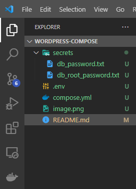
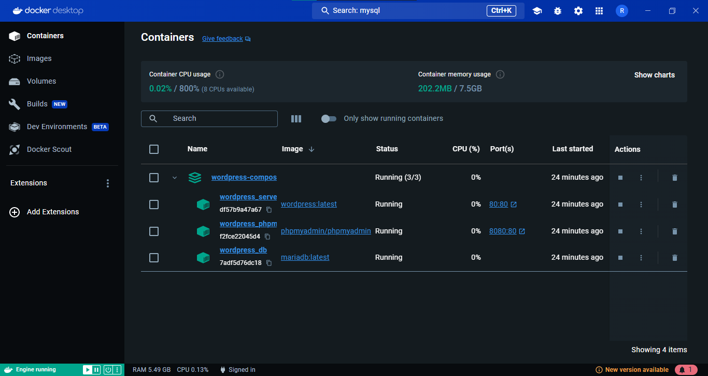

# compose-wordpress
A docker container with some utils services such as :
* Mariadb,
* Wordpress,
* Phpmyadmin 

# Requirements
Running this required :
* Docker client
* Some skills with docker off cause 😁

# Installation guid
To use this container, you must follow these steps :
* Firstly, create **db_password.txt** and **db_root_password.txt** files in the directory **secrets** to handle respectively your project db password and the mariadb root password.

  
* Secondly and off cause optionally, you can edit the **.env** file to fit your project env variable
* Finally, after running the docker daemon execute the command **docker compose up -d** and here we go 🚀😃. You can play with your **wordpress website**

